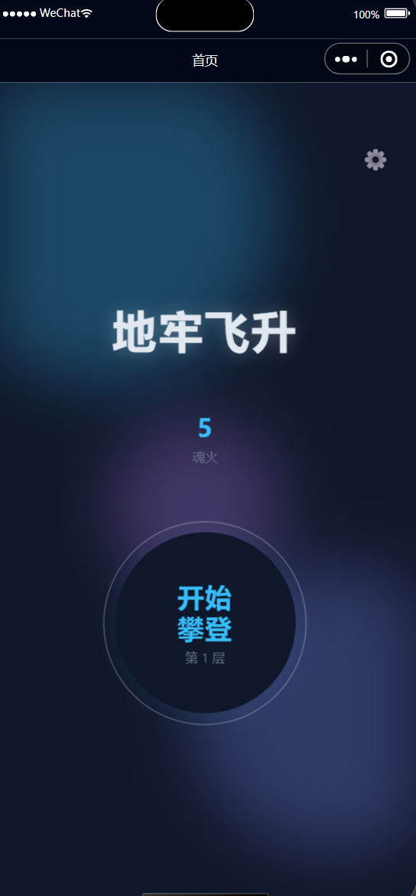
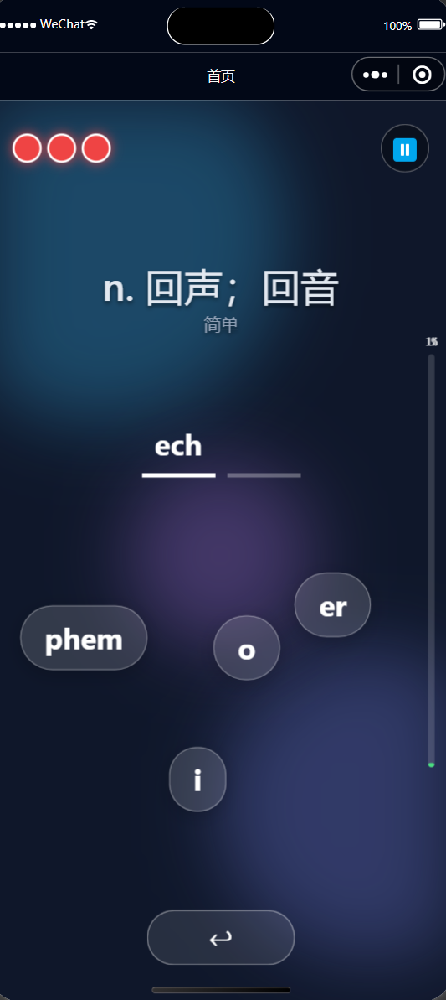

# 地牢飞升 · 记忆类小程序

一个基于 Taro 4 + React 的微信/多端小程序，用“爬塔”流程练习英文分音记忆。包含营地、记忆、战斗、结算、设置等完整循环，数据本地存储在小程序 Storage 中。

## 功能亮点
- 分阶段练习：先记忆单词分音，再拖拽/点击还原顺序，立即收到对错反馈。
- 地牢爬升成长：每次通关提升楼层，记录魂火、灯笼属性（亮度/燃料等）并保存在本地。
- 自定义设置：震动反馈、左滑翻页、默认显示提示均可切换。
- 多端构建：支持 `weapp`、`alipay`、`tt`、`h5` 等 Taro 目标平台。

## 玩法流程
1. **营地/Home**：查看当前魂火、楼层，点击“开始攀登”开启一轮。
2. **记忆阶段**：在倒计时内浏览 5 个随机单词，含分音标记、中文释义与难度。
3. **战斗阶段**：将漂浮气泡按正确分音顺序填入槽位，错误会扣血（灯笼燃料）。
4. **结算阶段**：展示正确/错误统计并结算魂火；若未到地表则继续下一层。
5. **设置页**：切换震动反馈、左滑下一张、默认提示等偏好。

## 界面预览
- 营地页（主页）  
  
- 记忆阶段  
  
- 战斗阶段  
  
- 结算阶段  
  
- 设置页（暂无截图，可后续补充 `docs/screenshots/05-settings.png`）

> 建议使用微信开发者工具或 Taro H5 预览截屏，保持 375×667 或 750×1334 分辨率。

## 快速开始
1. 安装依赖（推荐 Node 18+/npm 9+）
   ```bash
   npm install
   ```
2. 启动微信小程序实时编译
   ```bash
   npm run dev:weapp
   ```
   然后在微信开发者工具中选择 `dist` 目录作为小程序代码包。
3. 其他平台示例
   ```bash
   npm run dev:h5        # 浏览器预览
   npm run build:weapp   # 生成发布包
   ```

## 目录速览
- `src/app.config.ts`：小程序页面注册与窗口配置。
- `src/pages/index/`：主循环（营地、记忆、战斗、结算）页面与样式。
- `src/pages/settings/`：设置页组件与样式。
- `src/data/gameData.ts`：单词库（分音、释义、难度）。
- `src/utils/gameState.ts`：楼层、魂火、灯笼属性等存档逻辑（`dungeon_ascension_save`）。
- `src/utils/settings.ts`：用户偏好存储（`settings`）。

## 重要状态/存档
- 游戏进度与资源存储键：`dungeon_ascension_save`，含 `currentFloor`、`soulFire`、`lantern` 等。
- 设置存储键：`settings`，含震动、左滑翻页、默认提示。

## 截图占位更新指引
- 在 `docs/screenshots/` 放置 PNG/JPG 文件，命名与上文一致。
- 如需补充说明，可在“界面预览”下方添加要点（例如动效、配色）。
- 若使用其他分辨率，请在 README 中注明。

## 发布与调试提示
- 微信端：保持 `app.config.ts` 的 `navigationBarBackgroundColor` 与页面背景一致，避免闪白。
- H5 端：部分 Taro 组件动效可能与小程序略有差异，发布前建议 `npm run build:h5` 进行预览。
- 若想清空进度，调用 `resetGameState` 或在开发者工具中清理 Storage。

## 许可
当前仓库未声明开源协议，默认保留所有权利；如需开源请补充 LICENSE 并在此处更新说明。
